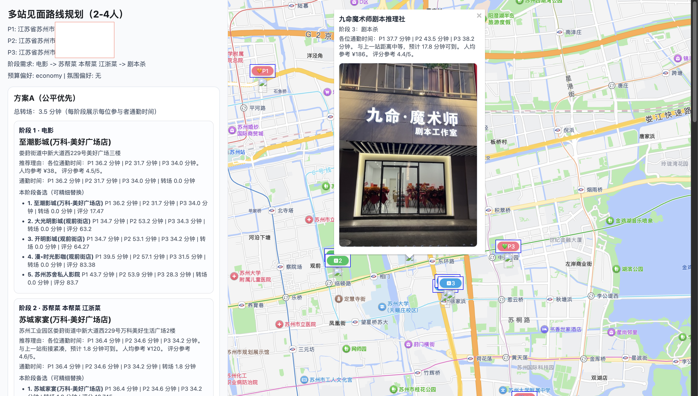
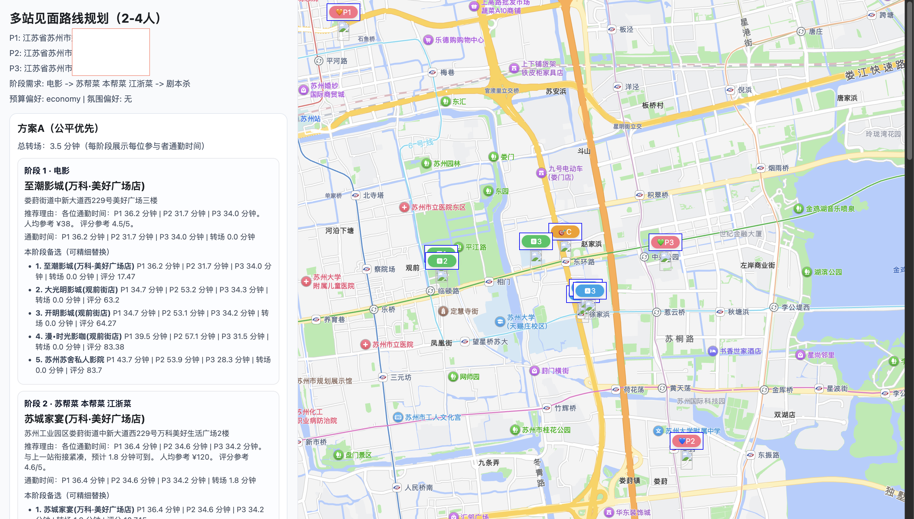

# Meetpoint Planner CN

Have you ever tried to meet friends in a big city and spent more time choosing a place than actually enjoying the meetup?
Have you ever felt that one person always travels much longer than everyone else?
Have you ever wanted a full plan for the day (movie, food, and activities) instead of a single location suggestion?

`meetpoint-planner-cn` is a Codex skill that builds fair meetup plans for 2 to 4 people in mainland China using AMap.
It supports one-stop suggestions and multi-stage routes such as:

- `movie -> dinner -> murder mystery game`
- `cat cafe -> dinner -> dessert`

The skill is designed to keep recommendations practical: balanced commute times, realistic transfers between stages, and choices that match budget and vibe.

## What this skill does

- Collects required planning inputs before generating recommendations.
- Geocodes each participant origin with AMap.
- Searches POIs around a fair center and dynamic stage anchors.
- Scores candidates by commute fairness, transfer time, semantic match, budget fit, and vibe hints.
- Produces two route variants:
  - Plan A: fairness-priority
  - Plan B: compact-experience-priority
- Exports an HTML result page with:
  - selected stops for each stage
  - backup options for each stage
  - per-person travel times
  - map markers and basic POI details





## Trigger conditions

- The user wants to plan a meetup in mainland China for 2-4 people.
- The user cares about commute fairness (not just a single nearby place).
- The user wants one-stop or multi-stage routing (for example: movie -> dinner -> game).
- At least two participant origins are available or can be collected in chat.

## Required inputs

Before planning, the following information must be known:

1. Participant origins (2-4 people)
2. Stage sequence (for example `movie -> dinner -> board game`)
3. City
4. Transport mode (`transit`, `driving`, or `walking`)
5. Maximum acceptable commute time per person
6. Budget preference (`economy`, `mid`, `premium`, or `any`)
7. Vibe preference (for example `lively`, `quiet`, `good for photos`)

## Project structure

- `SKILL.md`: skill behavior and conversation policy
- `scripts/find_meetpoint.py`: main planner and HTML renderer
- `references/category-mapping.md`: keyword normalization hints
- `agents/openai.yaml`: agent configuration

## Dependencies

- Python 3.10+
- AMap(高德地图) Web Service key (`AMAP_WEB_KEY` or `AMAP_API_KEY`)
- Optional AMap JS key for interactive map in HTML (`AMAP_JS_KEY`)
- Optional JS security code (`AMAP_JS_SECURITY_CODE`)

## Quick start

1. Register on the AMap Open Platform and create your API keys:
   - (Open Platform)[https://lbs.amap.com/]
   - (Key Console)[https://console.amap.com/dev/key/app/]

2. Set your API keys:

```bash
export AMAP_WEB_KEY="your_web_key"
export AMAP_JS_KEY="your_js_key"                  # optional
export AMAP_JS_SECURITY_CODE="your_security_code" # optional
```

Run a 3-person, 3-stage example:

```bash
python3 scripts/find_meetpoint.py \
  --origin "<placeholder>" \
  --origin "<placeholder>" \
  --origin "<placeholder>" \
  --city "<placeholder>" \
  --stages "<placeholder>-><placeholder>-><placeholder>" \
  --mode transit \
  --budget economy \
  --max-each-minutes 60 \
  --output ./meetpoint_itinerary.html
```

The script prints the selected route for Plan A and Plan B, then writes an HTML report.

## CLI arguments (main)

- `--origin` (repeat 2-4 times)
- `--city`
- `--stages`
- `--mode` (`transit` / `driving` / `walking`)
- `--budget` (`any` / `economy` / `mid` / `premium`)
- `--vibe`
- `--max-each-minutes`
- `--radius`
- `--option-topn`
- `--output`

Run `--interactive` for a guided terminal wizard.

## Output notes

- Plan A usually keeps commute differences smaller.
- Plan B usually keeps stage-to-stage movement shorter.
- The final choices still benefit from a quick manual check (opening hours, booking, and real-time crowd level).

## Recommended release positioning

Use this skill when users need:

- fair meetup planning for 2-4 people in China
- multi-stop routes (not just one POI)
- actionable alternatives at each stage for manual fine-tuning
